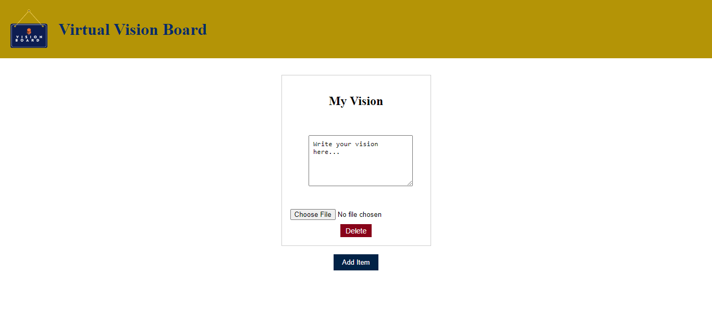

Virtual Vision Board App

https://chic-bienenstitch-afe560.netlify.app/

Create and visualize your dreams, aspirations, and goals with the Virtual Vision Board app. This React-based application allows you to create a personalized vision board, complete with images and written content. Keep track of your dreams and celebrate your achievements as you work towards your goals.

Features
* Add Items: Add new items to your vision board with customizable titles and content.
* Upload Images: Upload images from your device to represent your goals visually.
* Edit Content: Edit and refine your goals by updating the content associated with each item.
* Delete Items: Remove items from the board once you've achieved your goals.
* Persistence: Your vision board items are saved in local storage, ensuring that your progress is retained even after closing the app.

Getting Started
1. Clone the Repository:
git clone https://github.com/your-username/virtual-vision-board.git
cd virtual-vision-board

2. Install Dependencies:
npm install

3. Run the App:
npm start

4. Access the App:
Open your browser and go to http://localhost:3000.

Usage
* Add an Item: Click the "Add Item" button to create a new vision board item.

* Upload an Image: For each item, you can upload an image that represents your goal. Click the image input field to choose a file from your device.

* Edit Content: Edit the content associated with each item by typing directly into the textarea provided.

* Delete an Item: If you've achieved a goal, click the "Delete" button to remove the item from your vision board.

Contributing
Contributions are welcome! If you have any ideas, suggestions, or bug reports, please create an issue or submit a pull request.

License
This project is licensed under the MIT License.

Acknowledgements
Owner by Your Annah Nokutheza Mwanza
